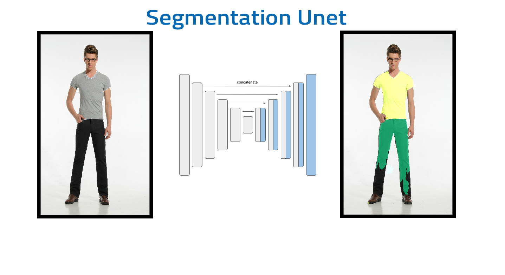

# DressUp
  

Proyecto desarrollado para participar en el "Reto DotCSV"


## Overview

DressUp es un algoritmo el cual tiene el fin de vestir a una persona con otro tipo de prenda.  Este consta de 2 arquitecturas de redes neuronales profundas.  

* Unet (modelo de segmentación)
* Pix2Pix 



La segmentación generada por nuestra primera Unet es coloreada de acuerdo a la prenda que queremos sustituir. 


```ruby
clothes_to_change={'playera_gris/playera_blanca': (255, 0, 0),
                    'playera_negra/playera_azul': (0, 255, 0),
                    'playera_rayas': (0, 0, 255),
                    'pantalon_negro': (0, 255, 255),
                    'sudadera_azul': (255, 255, 0),
                    'playera_tigre': (255, 0, 255)}            
```

En este caso seleccionamos el color azul, el cual corresponde a _"playera_rayas"_. Esta imagen es suministrada a la Unet-generadora para producir la prenda que reemplazaremos.


<p align="center">

</p>


El output final es el siguiente:
<p align="center">

</p>

El algoritmo cuenta soportada 6 prendas hasta el momento:
<p align="center">

</p>


## Training

<p align="center">

</p>

## Data

Para el entrenamiento de la primera arquitectura se optó por utilizar un dataset con una gran variedad de imagenes  _Clothing Co-Parsing _ (https://github.com/bearpaw/clothing-co-parsing) y para el caso del segundo modelo era necesario contar con un imágenes de una misma prenda  para ello fue de gran ayuda  _LookBook dataset_ (https://dgyoo.github.io), el cual cuenta con diversas fotografias de una misma prenda.

## Reference
* _Clothing Co-Parsing_ (https://github.com/bearpaw/clothing-co-parsing)
* _LookBook dataset_ (https://dgyoo.github.io)
* _Applications of GANS_ https://medium.com/@jonathan_hui/gan-some-cool-applications-of-gans-4c9ecca35900
